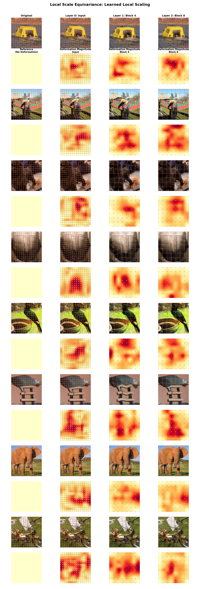

# LSE-DINOv2: Local Scale Equivariant DINOv2

<p align="center">
  
  
  
</p>

A **DINOv2 Vision Transformer** enhanced with **Deep Equilibrium Model (DEM)** based local scale adaptation for improved **scale equivariance** in image classification.

## 🔑 Key Features

- **Learned Local Scaling**: Learns to adaptively scale different image regions based on content
- **Deep Equilibrium Model**: Uses fixed-point iteration to find optimal deformation parameters
- **Multi-Layer Adaptation**: Applies scaling at multiple transformer layers for hierarchical equivariance
- **ImageNet-1K Trained**: Fine-tuned on ImageNet for 1000-class classification

## 📦 Installation

```bash
pip install torch torchvision timm transformers safetensors
pip install torchdeq  # Optional but Recommended: for DEQ solver, falls back to simple iteration if not installed. 
```

## 🚀 Quick Start

### Basic Inference

> **⚠️ Important**: This model uses custom code. The example below automatically handles downloading the custom code files (`modeling_lse_dinov2.py` and `configuration_lse_dinov2.py`) to the cache using `trust_remote_code=True` and `snapshot_download`. Make sure you trust the source before running custom code.

```python
import torch
import sys
from PIL import Image
from torchvision import transforms
from transformers import AutoConfig
from huggingface_hub import snapshot_download

# Helper function to load the model (handles custom code automatically)
def load_lse_dinov2(repo_name="ashiq24/lse-dinov2-base"):
    """Load LSE-DINOv2 model from HuggingFace Hub."""
    # Load config with trust_remote_code to download custom code
    config = AutoConfig.from_pretrained(repo_name, trust_remote_code=True)
    
    # Download model files to cache and get the directory
    cache_dir = snapshot_download(repo_id=repo_name, allow_patterns="*.py")
    
    # Add cache directory to Python path
    if cache_dir not in sys.path:
        sys.path.insert(0, cache_dir)
    
    # Import model class from downloaded files
    from modeling_lse_dinov2 import LSEDinoV2ForImageClassification
    return LSEDinoV2ForImageClassification.from_pretrained(repo_name)

# Load model
model = load_lse_dinov2("ashiq24/lse-dinov2-base")
model.eval()

# Move to GPU if available
device = torch.device("cuda" if torch.cuda.is_available() else "cpu")
model = model.to(device)

# Prepare image with ImageNet preprocessing
transform = transforms.Compose([
    transforms.Resize(256, interpolation=transforms.InterpolationMode.BICUBIC),
    transforms.CenterCrop(224),
    transforms.ToTensor(),
    transforms.Normalize(mean=[0.485, 0.456, 0.406], std=[0.229, 0.224, 0.225])
])

# Load and preprocess image
image = Image.open("your_image.jpg").convert("RGB")
pixel_values = transform(image).unsqueeze(0).to(device)

# Run inference
with torch.no_grad():
    outputs = model(pixel_values)
    predicted_class = outputs.logits.argmax(-1).item()

print(f"Predicted class: {predicted_class}")
```

### Deformation Visualization

The model learns content-aware local scaling transformations. Here's a visualization showing original images and their deformed versions at different layers:



*Each row shows an input image and its learned deformations at the input,  Layer 4, and Layer 8, along with the deformation magnitude heatmaps.*

### Extracting Learned Deformation Parameters

The model learns content-aware deformation parameters (phi) that can be obtained:

```python
# Get phi parameters for visualization
with torch.no_grad():
    phi_x_list, phi_y_list = model.get_phi_parameters(pixel_values)

for i, (phi_x, phi_y) in enumerate(zip(phi_x_list, phi_y_list)):
    print(f"Layer {i}: phi_x shape {phi_x.shape}, phi_y shape {phi_y.shape}")
```

## 🏗️ Architecture

### Base Model
| Component | Value |
|-----------|-------|
| Architecture | DINOv2 ViT-Base |
| Patch Size | 14×14 |
| Image Size | 224×224 |
| Embedding Dim | 768 |
| Transformer Blocks | 12 |
| Attention Heads | 12 |
| Register Tokens | 4 |

### DEM Adapter
| Component | Value |
|-----------|-------|
| Phi Layers | 3 |
| Local Scaling Grids | [16x16, 8x8, 8x8] |
| DEQ #Layers | 2 |
| CNN #Channels | [3, 64, 128] |
| DEQ Iterations | 5 |
| Applied at Layers | [input, 4, 8] |

## 📊 Additional Resources

For detailed information about the model architecture, training procedures, and experimental results, please refer to:

- **GitHub Repository**: [local-scale-equivariance](https://github.com/ashiq24/local-scale-equivariance) - Full codebase, training scripts, and documentation
- **Project Website**: [Local Scale Equivariance](https://ashiq24.github.io/local-scale-equivariance/#contributions) - Paper, visualizations, and additional resources


## 📈 Training Details

| Parameter | Value |
|-----------|-------|
| Dataset | ImageNet-1K |
| Optimizer | AdamW |
| Backbone LR | 5e-5 |
| DEM LR | 1e-5 |
| Epochs | 20 |
| Batch Size | 200 |


## ⚠️ Limitations

- **Computational Overhead**: Additional inference time due to DEQ iterations
- **Memory Usage**: Slightly higher than standard DINOv2
- **Dependencies**: Requires `timm` and optionally `torchdeq`

## 📄 License

Apache 2.0

## 🙏 Acknowledgements

- [DINOv2](https://github.com/facebookresearch/dinov2) by Meta AI
- [timm](https://github.com/huggingface/pytorch-image-models) by Ross Wightman
- [torchdeq](https://github.com/locuslab/torchdeq) for Deep Equilibrium Model implementation

## 📚 Citation

```bibtex
@inproceedings{rahman2025local,
  title={Local Scale Equivariance with Latent Deep Equilibrium Canonicalizer},
  author={Rahman, Md Ashiqur and Yang, Chiao-An and Cheng, Michael N and Hao, Lim Jun and Jiang, Jeremiah and Lim, Teck-Yian and Yeh, Raymond A},
  booktitle={Proceedings of the IEEE/CVF International Conference on Computer Vision},
  pages={10527--10537},
  year={2025}
}
```
